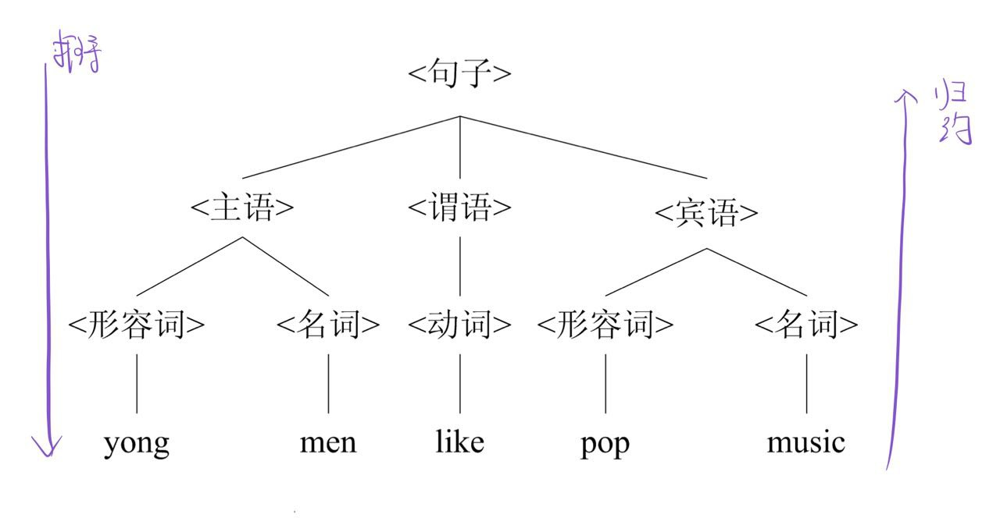
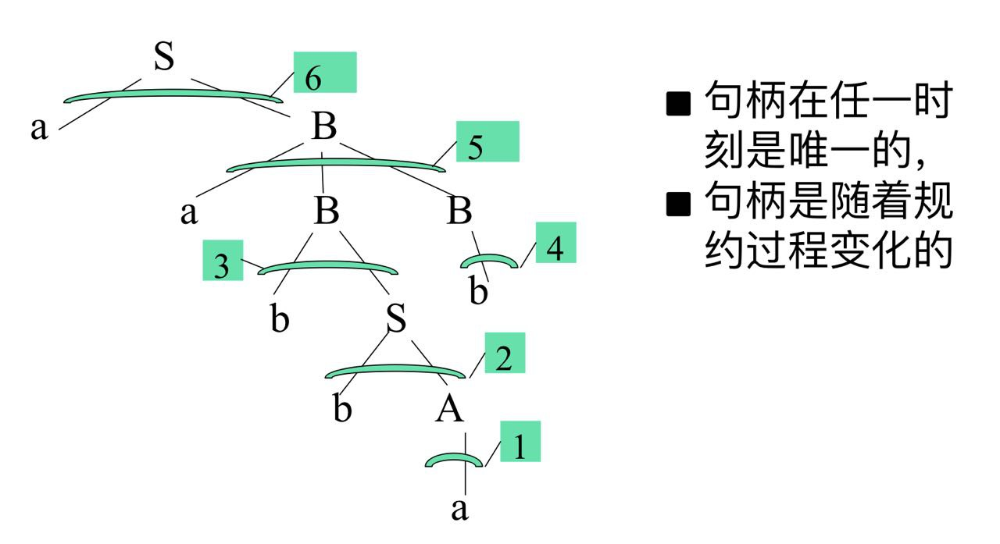

> 🐉2021 年与龙书斗争的第一天与最后一天

<!--more-->

# 第二章 语言与文法

## 语言

---

### 字母表与符号

|      名称      |          符号           | 定义                           | 例子                                       |
| :------------: | :---------------------: | :----------------------------- | :----------------------------------------- |
|      符号      | 一般小写字母,符号与数字 | 语言中不可再分的单位           | $a,b,c,+,-, 0,7,8$                       |
|     字母表     |        大些字母         | 符号的非空有穷集合             | $\Sigma = \\{a, b, c, +, -, 1, 2, ...9\\}$ |
| 符号串(字符串) |   用希腊小写字符表示    | 某字母表上的符号的**有穷序列** | $abc, +3, ...$                             |

### 语句

- 语句：字母表上符合某种**构成规则**的符号串序列

  > It is a pig.

- 语言：某字母表上句子的集合
- 符号串**集合**的积
  - $ A=\\{ \alpha_1, \alpha_2, ...\\} $, $B=\\{ \beta_1, \beta_2, ...\\}$,两者笛卡尔积为$AB = \\{ \alpha\beta  | \alpha \in A, \beta \in B \\}$
- 字符串**集合**的幂
  - $A^0 = \\{ \epsilon \\}$
  - $A^n = AA^{n-1}$
  - if $|A| = m$, then $|A^0|=1, |A^1|=m, |A^n|=m^n$
- Kleene 闭包
  - $A^\* = A^0 \cup A^1 \cup A^2 \cup ... $
    > $\\{ a, b \\}^* = \\{ \epsilon, a, b, aa, ab, ba, bb, aaa, aab, aba, ... \\}$
- 正闭包
  - $A^+ = A^1 \cup A^2 \cup ...  = A^* - \\{ \epsilon \\}$
    > $\\{ a, b \\}^+ = \\{ a, b, aa, ab, ba, bb, aaa, aab, aba, ... \\}$
- 一个语言一定是其字母表上闭包的子集

## 文法

- 文法：表示语言构成规则的形式化方法
- 产生式
  - $<句子> \rightarrow <主语><谓语><宾语> $
  - $<主语> \rightarrow <形容词><名词> $
  - $<谓语> \rightarrow <动词>$
  - $<宾语> \rightarrow <形容词><名词> $
  - $<形容词> \rightarrow young | pop$
  - $<名词> \rightarrow men | music$
  - $<动词> \rightarrow like$
- 产生式文法的组成
  - 非终结符($V_N$)
  - 终结符($V_T$)
  - 开始符号（$S$)
  - 产生式
- 推导：由产生式推导出句子
- 归约：由句子归约得出语法
  
- 句型：由语法树末端符（叶节点）从左到右连成串是文法的一个句型
- 句子：仅含终结符的句型
- 语言：由S推导所得的句子的集合
- 短语：子树末端符号从左到右连成串相对于子树树根而言称为短语
- 简单短语/直接短语：子树根经过一步推导得到的
- **句柄**：句型中**最左简单短语**
  

---

## 由文法产生语言

---

## 由语言构造文法

---
...这太慢了，换个策略，直接看完ppt,然后写点重点总结
