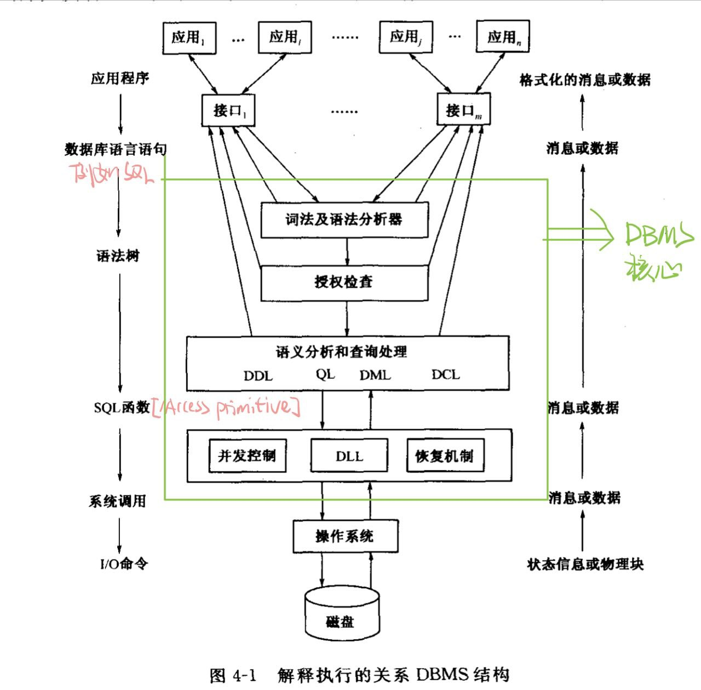
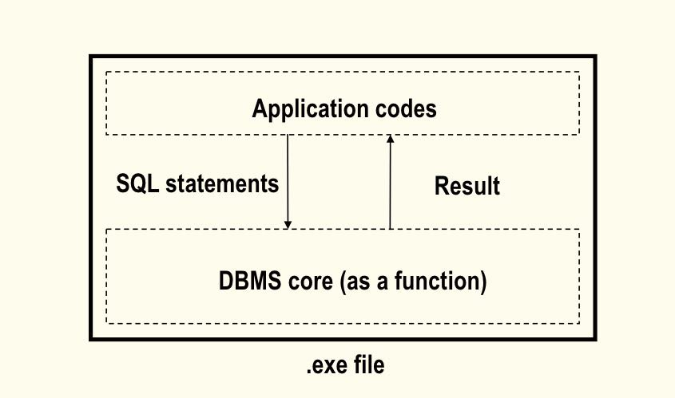
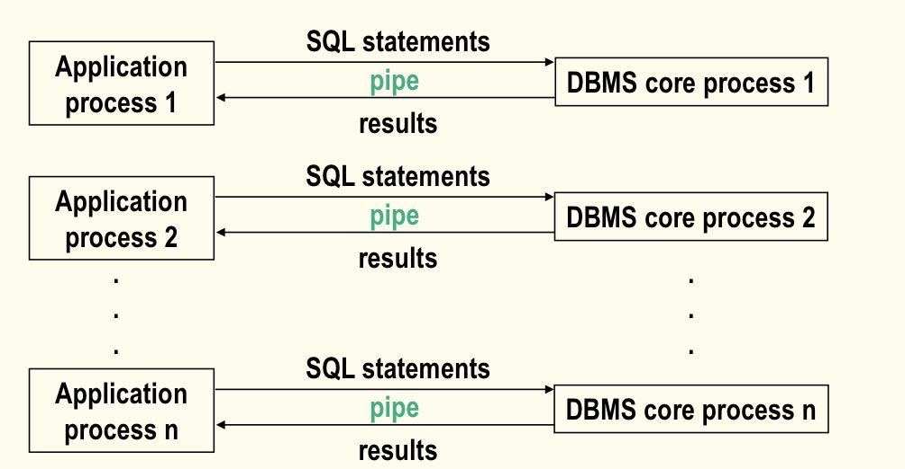
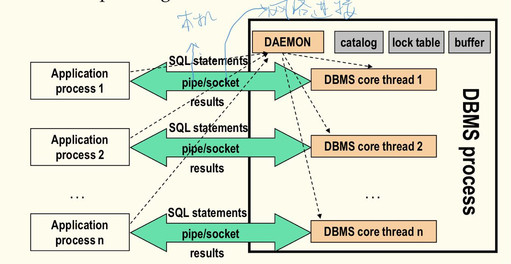
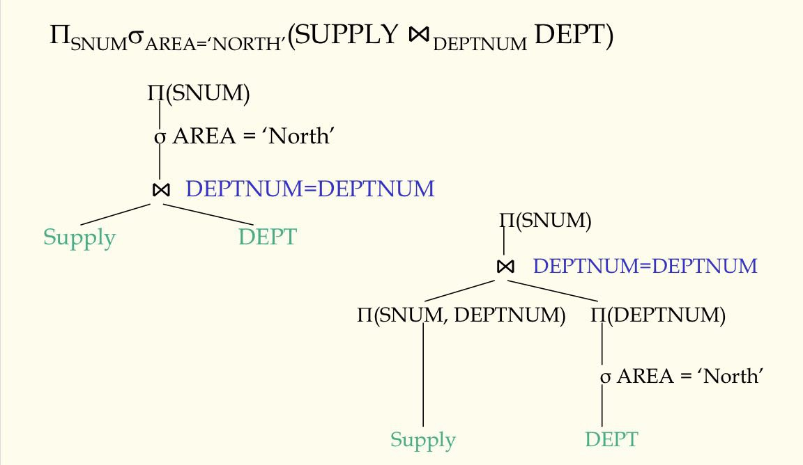
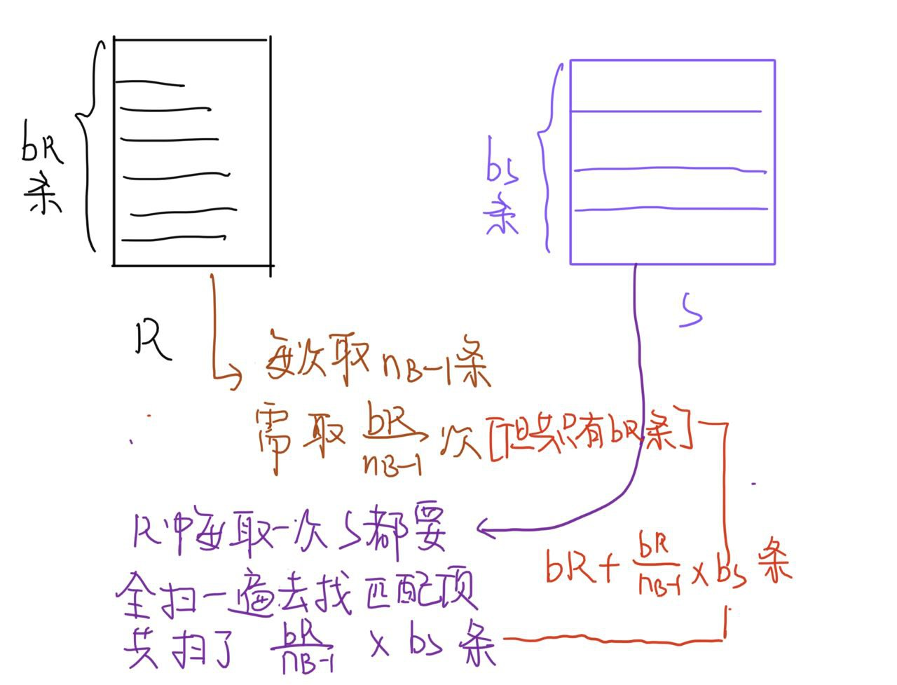
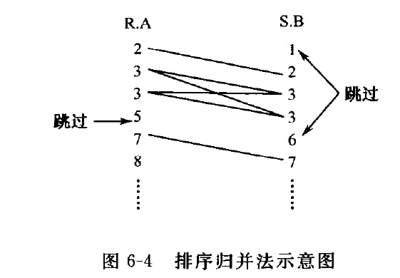
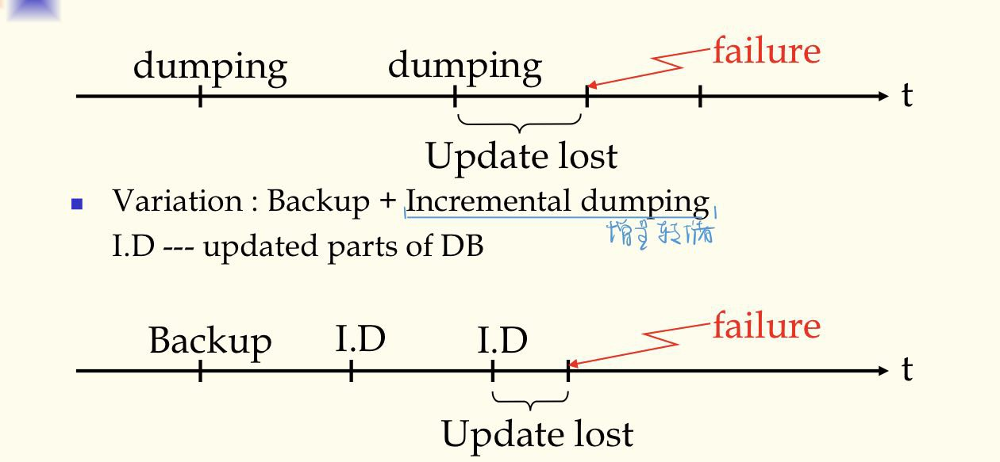
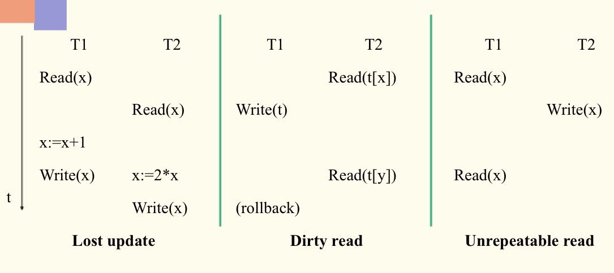
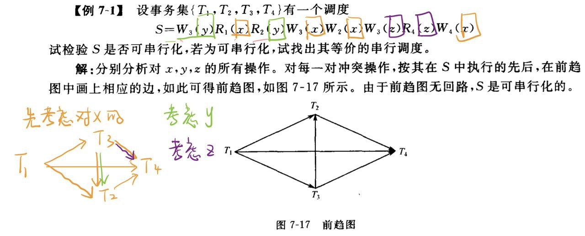

# 第四章 数据库管理系统引论
---


## 4.1 DBMS的核心组件



从上而下的解释：

* 用户写的应用程序经过接口转为基础的数据库语言（SQL等）
* SQL经过词法及语法分析产生语法树
* 之后检查用户是否有权访问语法树涉及的数据对象，若通过则继续执行，否则拒绝执行
* 授权检查通过后，进行语义分析与处理，对四种语言分别做不同处理（通常统称为查询处理），其中QL最复杂也最基本，存在多种存取路径选择问题（查询优化）
后就形成SQL语句执行
* DLL： 存放SQL的动态链接库
* 并发控制： SQL语句执行过程都有并发控制以防止多用户并发访问数据引起数据不一致 
* 恢复机制：发生故障时，能使数据库恢复到最近的一致状态或先前的某个一致状态 
* DBMS是操作系统之上的软件系统，是操作系统的用户,它对系统资源的调用需要请求操作系统为其服务，通过系统调用来实现


#### 补充--事务概念
事务是DBMS的执行单位，由有限的数据库操作序列组成，满足ACID准则
ACID准则：
1. ( Atomic )执行的原子性
    * 不允许事务部分地完成
2. (Consistency)更新操作的保持一致性
    * 事务应使数组库从一个一致状态转到另一个一致状态。如一个帐号收支之差应等于余额，若对这个帐号只拨款，不改余额，则数据库就不一致了。（一致状态也就是数据要满足完整性约束）
3. (Isolation)彼此的隔离性
    * 若多个事务并发执行，则应像各个事务独立执行一样
4. (Durability)作用的持久性
    * 事务对数据库的影响是持久的，即使数据库因故障受到破坏，DBMS应该也能使其恢复



## 4.2 DBMS的进程结构
### 单进程结构
一个应用程序经过DBMS编译后作为一个单独的可执行文件，以一个单独进程进行执行。DBMS core作为这个可执行文件的一个函数


### 多进程结构
* 一个应用程序进程对应一个DBMS core进程


* 只有一个DBMS core进程，每个应用程序进程对应一个DBMS线程


## 4.3 数据库访问管理

### 访问类型
* 查询一个文件的全部或大部分记录(>15%)
* 查询某一条特定记录
* 查询某些记录(<15%)
* 范围查询
* 记录的更新

### 文件管理
#### 文件的基本类型
* 堆文件
  * 记录按插入顺序存放，就像堆货物一样。物理地址不一定连续，逻辑地址连续。插入容易，查找难，只能顺序搜索，删除麻烦，一般不在物理上删除，只是打删除标志，以免引起大量记录转移。
* 直接文件
  * 将记录某一属性（一般为主键）用散列函数映射成记录的地址。按散列键访问快，但不同散列键可能映射同一地址，且只对散列键到记录的访问有效，键映射空间固定，不变处理变长记录，用得少
* 索引文件
  * 索引+堆文件/簇集
  * 在记录的某一属性（组）上建立索引，索引项由索引键的值及其对应的记录的地址货地址集组成。
  * 提高查询效率，增加索引维护开销，付出储存空间代价

#### 动态索引
* 静态索引是多分树，动态索引是平衡多分树(B-Tree),常用的是B+树


#### B-Tree和B+-Tree区别
* B-Tree
  * 键值不可重复存储，没有重复的键和记录
  * B树的优势是当你要查找的值恰好处在一个非叶子节点时，查找到该节点就会成功并结束查询
* B+-Tree
  * 键是存在内部节点的索引
  * 记录存在于叶节点
  * 平衡二叉树，所有叶节点同高
  * 叶节点用链表连接,所以**支持range-query(区间查询)非常方便，而B树不支持。这是数据库选用B+树的最主要原因**
  * 在B+树中，无论查找成功与否，都是走了一条从根到叶子节点的路径。


#### 动态散列(应该不考)
#### 栅格结构文件(不考吧)
适合多属性查询

#### Raw disk
Can control physical blocks in OS by using raw disk

## 4.4 查询优化
### 代数优化
* 优化原则
  1. 先一元操作，后二元操作(Push down the unary operations as low as possible)
  2. 优先连接小关系(Look for and combine the common sub-expression)
* 查询树
  * 叶子： 关系
  * 中间节点：一元或二元操作
  * 叶子$\rightarrow$根:操作执行的顺序
* 例子
  

### 操作优化
> 代数优化不涉及存取路径，只能对操作次序和组合进行变换与调整;合理选择存取路径，才是优化的重点,以下四个不做讨论
> * 选择操作优化
> * 投影操作优化
> * 集合操作优化
> * 连接操作优化
> * 组合操作优化

* **连接操作的实现**
> 因为连接开销很大，其中二元连接最基本用的最多，所以历来是查询优化研究重点
  * **嵌套循环法**：就一个一个拿出来比较，相同的作为结果输出，两层循环
    * R为外关系，共$b_R$条记录，S为内关系，共$b_S$条记录,R每次I/O取出的为缓冲块大小的元组个数，设有$n_B$个缓冲块,一块用于内关系缓冲，其余用于外关系缓冲,则共需访问物理块数,从公式可以看出要想减少I/O次数，应该让小关系作为内关系，因为它前面有个乘数。
  $$
  b_R + \frac{b_R}{n_B - 1} * b_S
  $$


* 为什么缓存块都给外缓冲？
* 因为，**内关系的扫描次数取决于外关系分多少次取完，外关系每次取的越多，则内关系一次扫描所比较的元组也越多**。而内关系每次扫描都要I/O整个表，而总的I/O次数中外关系的I/O次数是定值（它只用扫描一次），内关系的I/O次数只取决于其扫描次数$\rightarrowtail$其扫描次数只取决于外关系取的次数$\rightarrowtail$外关系取的次数取决于每次取多少，所以增大外缓冲能有效减小内关系扫描次数。


  

  * 利用索引或散列寻找匹配元组法：通过内关系多次顺序扫描匹配元组
  * 排序归并法：先将R，S按属性排序，这样后面搜匹配项时就不用看前面的了
    
  * 散列连接法：连接属性应有相同域，所以将连接属性散列到同一个文件，这样符合条件的R与S元组必然在一个桶中，然后用嵌套循环法就可以得到匹配结果

* 优化策略
  * 俩关系已按属性排序，优先考虑排序归并法。一个以排序，另一个很小，则也可用排序归并法
  * 若两关系有一个关系在连接属性上有索引或散列，则可以另一关系为外关系，顺序扫描，并利用内关系上索引或散列寻找匹配元组
  * 若上述都不满足，且关系比较小，用嵌套循环法；否则，可用散列连接法

## 4.5 数据库恢复
> 数据库恢复途径：
> * 预防：减少可能发生的失败
> * 解决：从失败中恢复

### 基础介绍
* 定期转储（单纯以后备副本为基础的恢复技术）
  * 每隔一段时间进行一次全量备份
  * 改进：增量转储，每次全量转储后，只对改变部分进行转储
  

* backup+log（以后备副本和运行记录(log/journal)为基础的恢复技术）

  log 的内容
  * BI(前像)：事务更新时所涉及物理块更新前的映像；有前像可使数据库回到更新前状态，即撤销更新undo,满足幂等性,就是无论undo几次都和undo一次的效果一样
  $$
  undo(undo(undo(...(x)...))) = undo(x)
  $$
  * AI(后像)：事务更新时所涉及物理块更新后的映像；有后像即时更新数据丢失，仍可恢复到更新后状态，叫重做redo,也满足幂等性
  $$
  redo(redo(redo(...(x)...))) = redo(x)
  $$
  * 事务状态：两种,commit了，说明事务已成功执行(all)；事务失败，则要消除事务对数据库影响(nothing)，叫卷回(abort/rollback)
    数据库失效时，可取出最近副本，再根据运行记录
    * 对已提交的事务**用后像重做**，叫**向前恢复**
    * 对未提交的事务**用前像卷回**，叫**向后恢复**
    这样可使数据库恢复至最近的**一致状态**


### 运行记录结构
1. 活动事务表（ATL）：记录所有正在执行还没有提交的事务的标识符（TID）
2. 提交事务表（CTL）：记录所有已提交的事务的标识符
3. 日志

### 更新事务的执行与恢复
#### 两/三条更新事务执行时原则：
  * 提交规则：后像必须在事务提交前写入非易失存储设备（数据库或运行记录的后像文件中)
  * 先记后写规则： 若后像在事务提交前写入数据库，则必须把前像先记入运行记录
  * 前像和后像的幂等性

#### 三种更新策略（后像写入数据库的时机不同）：
* 在事务提交前写入DB
  1. TID$\rightarrow$ATL
  2. BI$\rightarrow$log [Log Ahead Rule]
  3. AI$\rightarrow$DB, log [Commit Rule]
  4. TID$\rightarrow$CTL
  5. rm TID from ATL

可能发生情况
  |  CTL  |  ATL  | OP                    |
  | :---: | :---: | :-------------------- |
  |   0   |   1   | Undo, rm TID from ATL |
  |   1   |   1   | rm TID from ATL       |
  |   1   |   0   | nothing to do         |
* 在事务提交后写入DB[所以根据先记后写原则，不必记入BI][现在流行]
  1. TID$\rightarrow$ATL
  2. AI$\rightarrow$log [Commit Rule]
  3. TID$\rightarrow$CTL
  3. AI$\rightarrow$DB
  5. rm TID from ATL

可能发生情况
  |  CTL  |  ATL  | OP                    |
  | :---: | :---: | :-------------------- |
  |   0   |   1   | rm TID from ATL       |
  |   1   |   1   | redo, rm TID from ATL |
  |   1   |   0   | nothing to do         |
* 在事务提交前后写入DB
  1. TID$\rightarrow$ATL
  2. AI, BI$\rightarrow$log [Commit Rule]
  3. AI$\rightarrow$DB(partially done)
  4. TID$\rightarrow$CTL
  5. AI$\rightarrow$DB(completed)
  6. rm TID from ATL

可能发生情况
  |  CTL  |  ATL  | OP                    |
  | :---: | :---: | :-------------------- |
  |   0   |   1   | undo, rm TID from ATL |
  |   1   |   1   | redo, rm TID from ATL |
  |   1   |   0   | nothing to do         |

---
## 4.6 并发控制
### 并发好处
* Improving system utilization & response time.
* Different transcation may access to parts database.

### 并发的问题
* 丢失更新:两个事务同时对一个数据项更新，并发写入会有一个事务的更新被覆盖丢失。与两事务串行执行结果不同。write-write conflict
* 读脏数据:一个事务对某个元组中两个属性进行更新，一个事务则读取这个元组，并发执行会让这个元组的两个属性不一致，比如一个已更新一个未更新。读取的是个不存在的元组。read-write conflict
* 读值不可复现：一个事务读取一个数据两次，另一个事务并发修改了这个事务导致读取的两个数据不同。两事务若串行执行不会有此现象。这也是read-write conflict


### 并发一致性准则--串行化
* 若两个事务集合并发执行的结果与串行执行的结果相同，则这个并发调度是可串行化的。
* 判断是否可串行化的方法：前趋图
  * 对于某个数据的读写操作i都在j之前完成，则可加一条$T_i \rightarrow T_j$
  
  * 按照拓扑排序得到结点队列$T_1 \rightarrow T_3\rightarrow T_2\rightarrow T_4$
  


简单的说，每次把入度为0的结点如队列即可


### 加锁协议
#### X锁(排他锁)

|   \   |  NL   |   X   |
| :---: | :---: | :---: |
|  NL   |   Y   |   Y   |
|   X   |   Y   |   N   |


#### (S,X)锁
* S锁加上后，可以读但不可写

|   \   |  NL   |   S   |   X   |
| :---: | :---: | :---: | :---: |
|  NL   |   Y   |   Y   |   Y   |
|   S   |   Y   |   Y   |   N   |
|   X   |   Y   |   N   |   N   |
#### (S,U,X)锁
* S锁下可以加更新锁
* U锁下不可加更新锁
* 反正开卷怕什么

|   \   |  NL   |   S   |   U   |   X   |
| :---: | :---: | :---: | :---: | :---: |
|  NL   |   Y   |   Y   |   Y   |   Y   |
|   S   |   Y   |   Y   |   Y   |   N   |
|   U   |   Y   |   Y   |   N   |   N   |
|   X   |   Y   |   N   |   N   |   N   |

### 死锁和活锁
> * 死锁：循环等待，没有事务可以得到需要的资源来完成事务
> > * 解决：预防不让它发生;解决（发生了但可解决它)
> * 活锁：别的事务一直占用资源，低优先级的一直拿不到资源
> > * 解决：FIFO策略

#### 死锁检测
* Timeout:若一个事务等待超过了设定的时间，则认为死锁发生，该事务应该被放弃
* 循环等待图：出现回路则发生死锁

#### 死锁避免
> 当事务申请锁未获准时不是一律等待，而是让一些事务卷回重执(retry),以避免循环等待。为区别事务开始执行的先后，给他们一个随时间增长的时间标记ts(time stamp)
* 事务重执有两种策略
  * 死亡-等待wait-die:年老的等年轻的事务,年轻的来了，则重执，一直到自己变得年老而等待
  * 击伤-等待wound-die:年轻的等年老的，年老的来了，把年轻的击败，年轻的重执时直接等待


# 第五章 数据库的安全性和完整性约束
---
> 1. 系统的软硬件故障 【DBMS的恢复机制】
> 2. 用户的并发访问控制不当 【DBMS的并发控制】
> 3. 人为破坏 【数据库的安全性】
> 4. 数据库输入的数据不正确 【数据库的完整性约束】
## 5.1 数据库安全性
### 保证数据库数据安全的措施

1. 利用视图和查询修改
2. 访问控制（对用户进行分类来给不同的权限 ）
  - 普通用户
  - DBA
  - 有资源特权的用户
3. 用户标识和用户认证
  - 通过password进行用户认证
  - 特殊的物品，如钥匙. IC卡等等
4. 授权
5. Role角色机制（通过该方法提高权限控制）
6. 数据加密
  - 加密后存储【密码学】，但是加密解密影响效率
7. 审计追踪
  - 结合数据库日志，可以在关注的对象上添加审计追踪，会记录该对象上进行的操作

## 5.2 数据库的完整性约束
> 完整性约束就是规则，一张表内所有元组都要满足的条件就是完整性约束

### 完整性约束的分类
* 静态约束
  - 固有约束：数据模型固有的约束，如关系属性应该是原子的,即第一范式
  - 隐含约束：数据库表的模式定义里面的约束,一般用DDL语句说明，如：域约束、实体完整性约束、外键约束【引用完整性约束】
  - 显式约束：书p181,没解释清
* 动态约束
  * 数据库在状态转换中要满足的约束叫做动态约束(可以和触发器联系)

### 完整性约束的说明
* 用过程说明：把约束的说明和检验交给应用程序
* 用断言说明：断言指数据库状态必须满足的逻辑条件
* 在基表定义中加入`CHECK`子句约束
* 用触发子表示约束,下小节细讲

## 5.3 触发子(Triggers)
> - 主动数据库：能对数据库采取一些主动的动作。
>     - 数据库的主动依赖于规则
>         - 规则：ECA规则，E为事件、C为条件、A为动作。
>         - 即当事件A发生，且条件C满足时，采取A动作
### 组成
* Event: activates the trigger
* Condition: tests whether the triggers should run
* Action: what happens if the trigger runs

### 实例
```sql
CREATE TRIGGER youngSailorUpdate          --声明触发器
AFTER INSERT ON SALORS                    --Event
REFERENCING NEW TABLE NewSailors          --对水手表新插入的元组看成一张表
FOR EACH STATEMENT                        --触发行为
INSERT
  INTO YoungSailor(sid, name, age, rating)
  SELECT sid, name, age, rating
  FROM NewSailors N
  WHERE N.age <=18
```
### 触发器的执行策略

- 立即执行【常用】
  - 当事件发生时立刻去检查条件是否满足
- 延迟执行
  - 等事务要提交时执行
- 分离执行
  - 把ECA规则中的动作单独作为一个事务，作为原来事务的衍生事务
# 第六章 数据库设计
---
## 数据依赖
- 关系数据库内数据之间存在一定的数据依赖关系

### 函数依赖FD
- 一个属性的值可以唯一的决定其它属性的值

### 多值依赖MVD
- 一个属性的值决定其它属性的一组值
- 实际生活存在但很少

### 连接依赖JD
- 关系属性之间能够无损连接
    - 无损连接：连接后的元组数一个不多，一个不少
- 实际生活存在但很少

## 6.1 关系模式的规范化
### 关系模式的范式理论
### 1 NF 一范式
- 不支持表中套表
- 关系中的每一个元组必须是原子【即不可再分】
### 2 NF 二范式
- 数据库设计时，设计出来的表满足一范式，并且该表内不存在属性对主键的部分函数依赖。
- 例子：若属性由（学号、姓名、班级、课程号、成绩）五个属性组成，其中（学号，课程号）共同组成主键。
  - 此时不满足二范式。
  - 其中的姓名和班级，只需要依赖主键中的学号就可以得到。
* 不满足2范式容易出现的问题：
  - 插入异常
      - 上例中，不能插入一个还未选课的学生的信息
  - 删除异常
      - 上例中，如果一个学生申请休学，把选过的课退了，那么他的信息也会被删除
  - 更新异常
      - 更新中难以保持数据的一致性，上例的设计有大量的数据冗余

### 解决方法
- 设计时，一视一地。
    - 一张表只管一件事情
### 3 NF 三范式
- 在满足二范式的前提下，不存在属性对主键的传递依赖。

### 例子
- 若属性由（职工编号、工资级别、工资）三个属性组成，其中（职工编号）为主键。

### 分析
- 工资取决于工资级别，取决于职工编号

### 上例不满足3范式的问题
- 插入异常：当一个人的工资级别还没定的时候，他对应的工资也没有
- 删除异常：若只是删除一个员工的工资信息时，会把对应的工资级别信息也删除了
- 更新异常：数据内有大量的冗余
### 解决方法
- 设计时，一视一地。
    - 一张表只管一件事情

### 4 NF 四范式
- 在满足三范式的前提下，消除多值依赖。

### 5 NF 五范式
- 在满足四范式的前提下，消除连接依赖。

## 6.2 数据库设计方法

### 面向过程的方法

- 根据单位日常处理的流程，以过程为中心。
    - 好处
        - 在设计初期，能比较快的实现
    - 缺点
        - 没分析数据之间的关系，数据由冗余和矛盾，当流程进行改动时，会有很多问题

### 面向对象的方法

- 以数据为中心的方法
- 分析数据之间的关系，设计一些符合3NF的模式

## 6.3 数据库设计流程

- 需求分析，与用户交流确定需求
- 概念设计，分析数据之间的关系、实体及实体间的逻辑
- 逻辑设计，看采用的数据库系统，生成基表
- 物理设计，考虑数据在内存上到底如何存储

## 各阶段主要工作

### 需求分析阶段

- 数据字典
    - 把所有的基本数据元素都找出来
        - 解决问题：
            - 名字冲突：同名异意
            - 概念冲突
            - 域冲突
            - 编码问题
                - 压缩信息
                - 基本信息
                - 实体识别

### 概念设计阶段

- 用ER图抽象出实体
- 哪些数据项抽象成实体
- 实体间的联系
- 相关ER图工具

### 逻辑设计阶段

- 把ER图表达的数据模型进行建表
- 表和属性的命名规则
- 逆规范化
- 定义视图
- 考虑遗留系统的表的设计

### 物理设计阶段

- 根据DBMS特点对每个表的存储和索引情况进行权衡
- 分区设计

## 总结

- 仅仅在结构上满足3范式是不够的
- 一事一地包括每项信息的唯一，要提取出问题的本质，识别本质上同一概念的信息项
- 对于表达类似信息、能合并尽量合并
- 考虑到效率、用途等因素、该分开的要分开
- 结合DBMS内部实现技术，合理设计索引和文件结构，为查询优化准备号存取路径
- 在结构规范化、减少数据冗余和提高数据库访问性能之间仔细权衡，适当折中


  

