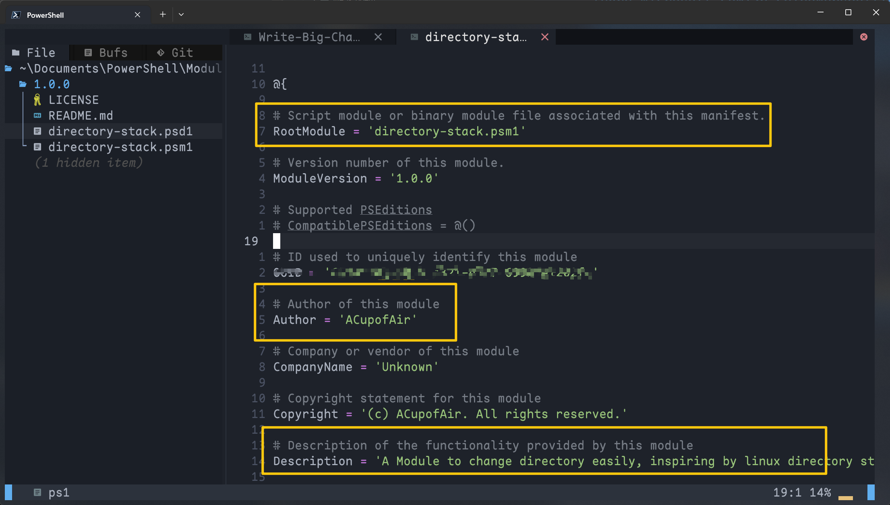
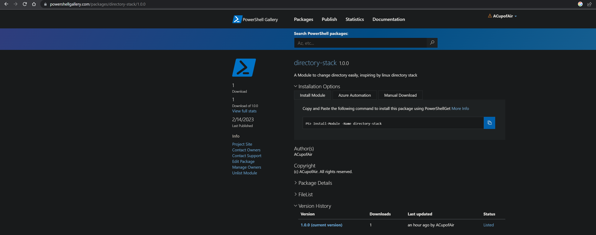

图中受启发于 linux 的目录栈功能，可以方便的将常用目录存在栈中，然后按照序号来进行跳转，具体安装使用说明见
[:link:Github 仓库](https://github.com/ACupofAir/Directory-Stack),本文聚焦于如何创建并发布一个 powershell
模块

## 创建模块

- 模块名以`*.psm1`结尾，且要求模块的目录名与模块同名

  - 我们可以创建一个`directory-stack`目录
  - 在该目录下创建`directory-stack.psm1`
    
  - 在`directory-stack.psm1` 中写一个函数
    ```powershell
    function Print-Hello($name)
    {
      echo "hello, $name"
    }
    ```

  至此一个最简单的模块就已经写好了

## 引用模块

- 在`$PROFILE`中导入引用
  - `$PROFILE`是 powershell 的默认配置文件，可以直接中终端中输入来获得其位置，用文本编辑器打开后，在其中加入
    `Import-Module -Name $Module-Path -DisableNameChecking`, 其中`$Module-Path`替换成你模块的目录地址，相对的绝对的都可以
- 或者移动模块目录到系统默认模块存储位置来引用
  - powershell 模块有其默认的存储位置在 powershell 中执行`$env:PSModulePath`即可看到, 将刚刚的模块目录移动到系统默认模块目录下即可调用模块

* 然后重开一个 powershell 就可以调用`Print-Hello`函数了
  

## 发布 powershell 模块

> 发布则是将本地模块上传至 powershellgallery, 这样用户可以通过 PowerShellGet 来快捷安装模块

### 生成模块清单

> 如果需要发布，必须生成模块清单，里面包含作者信息，模块描述，以及暴露给系统使用的模块函数

- 在模块目录下创建模块清单文件,文件名以`*.psd1`结尾
  - `New-ModuleManifest -Path directory-stack.psd1 -ModuleVersion "1.0" -Author "$your_name"`
- 配置模块清单,详细的配置请参考[:link:微软官方文档](https://learn.microsoft.com/zh-cn/powershell/scripting/developer/module/how-to-write-a-powershell-module-manifest?view=powershell-7.3#sample-module-manifest)
  
  - `Author`: 必要的，作者名字
  - `Description`: 这个也是必要的，描述一些模块
  - `RootModule`: 必要的，为你的模块入口文件，本例中即为`directory-stack.psm1`
  - `FunctionsToExport`：此处为系统导入模块后，可以调用模块中哪些函数
    

### 注册 powershellgallery 并配置 api

- 注册/登录这个网站[:link:https://www.powershellgallery.com/](https://www.powershellgallery.com/)，后面的模块就是上传到这
- 配置 api
  
  - name: 随便取
  - Glob Pattern: 这个是一个正则表达式，匹配你要上传的模块名，注意式 glob 正则，所以`.`不匹配任意字符

### 发布模块

- `Publish-Module -Path $module_path -NuGetApiKey $your_api -Verbose`
- 一般会报错，需要安装 dotnet,一个.net 的 sdk,[:link:官方地址](https://dotnet.microsoft.com/en-us/download/dotnet?cid=getdotnetcorecli), 然后就成功了
- 发布成功后，仓库中马上就可以搜到，用户也可以`Install-Module -Name directory-stack`来直接安装，会安装到 powershell 默认的 module 目录下
  
