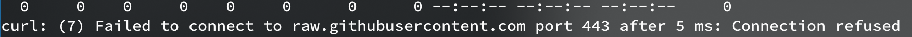
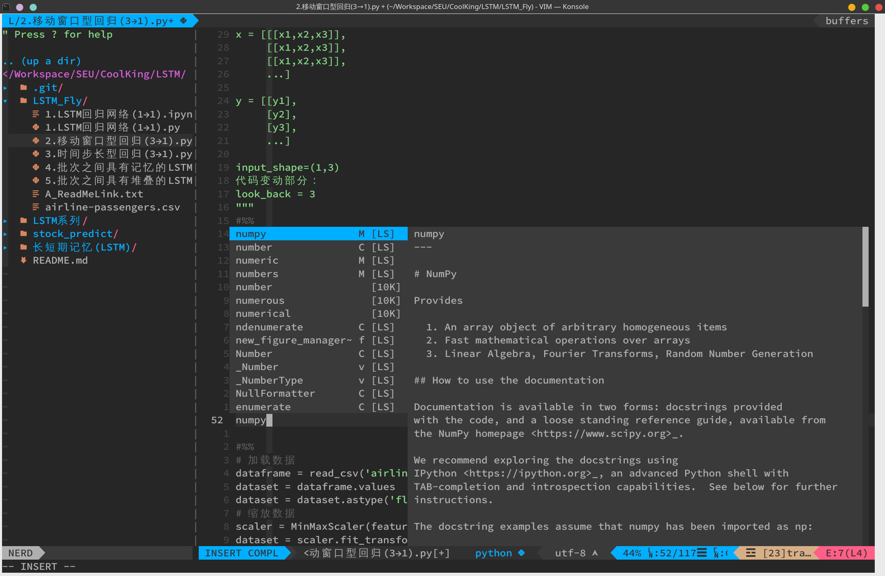

# archlinux中vim的配置

## 基础配置
如果你是在一个没有桌面的环境下想有个良好的vim体验，只需简单两步：
1. 拉下我的代码,curl是linux下net-tools包里的,arch下`sudo pacman -S net-tools`即可安装. `-o`参数后为拉下来的网页保存为的文件名,下面代码是将我寄存于github上的vim配置文件下下来并保存到temp.vim这个文件中,至于为什么不直接保存到`~/.vimrc`下,因为我没试过，and此时此刻**懒得**试。
```shell
curl https://raw.githubusercontent.com/ACupofAir/scripts/main/vimscripts/vim_next_ngui.vim -o temp.vim
```
当然如果你是在中国，又恰巧忘记给终端配置代理，那你可能会遇到



只需简单的
```shell
export http_proxy=your_proxy_ip:port; export https_proxy=your_proxy_ip:port
```
2. 然后把这个`temp.vim`文件拷贝到你的个人根目录的`.vimrc`
```shell
cp temp.vim ~/.vimrc
```
然后可以把`temp.vim`删掉了

下面介绍一下这套基础配置带来的一些关键功能:
* **相对行号**  这个在可以比较直观的显示你目前键入位置，同时这个相对行号在复制多行代码时也比较有用，自己肉眼看有时候会数错
* **语法高亮**  默认情况下在tty中貌似不开的，得手动开
* **智能搜索** 就是你输入全小写的，则他会匹配大小写都有的，但你输入一个大写字符，它就会变得大小写敏感
* **配置了一些常用快捷键** 首先把<leader>配置为空格键

|快捷键|功能|
|:--:|:--|
|`<leader> e`|打开vim自带的文件树|
|`<leader> nh`|`:nohl`快速取消高亮| 
|`<leader> q`| 不保存退出文件(因为人类的手指真的很不适合连按`q`和`！`)|
|`<leader> rn`|`*Ncgn`,这个很体现vim的牛皮之处，`*`选中当前单词的所有匹配项，并将光标移到下一个匹配项，`N`则反向跳转到上一个匹配项，也就是你一开始按`*`的位置，然后`cgn`改变这个单词，然后下面按`.`重复上述操作就可以执行让一个操作，也就是改变下一个匹配的单词为上一个你改成的单词,说人话就是匹配修改相同单词变量，按`.`修改下一个，不解释自行体会|
|`<leader> m`|写了个无聊的函数用于控制是否允许鼠标操作，应该是当时老误触写的，后来用发现kde有个打字时自动禁用触摸板的设置，就没怎么用过|

* 还有一些小功能，比如窗口调整大小，用到这地步自己看看代码也就明白了，不解释。

## 高级配置
您就将就着我的[配置文件](https://github.com/ACupofAir/dotfiles/blob/main/vimrc)看看吧，都玩vim了肯定要自己玩才有意思嘛。

最后给个让人眼馋的成品图



