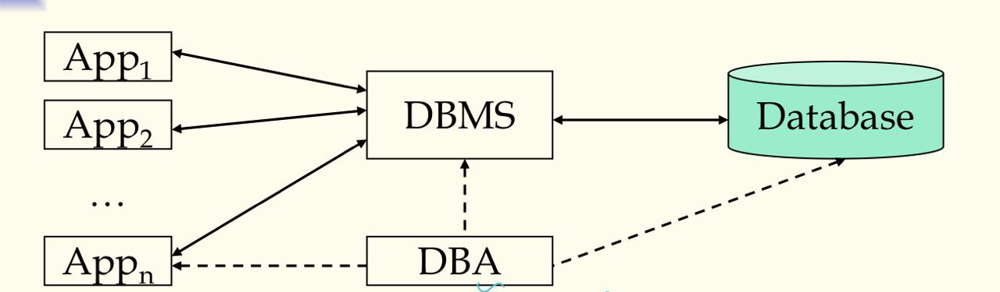
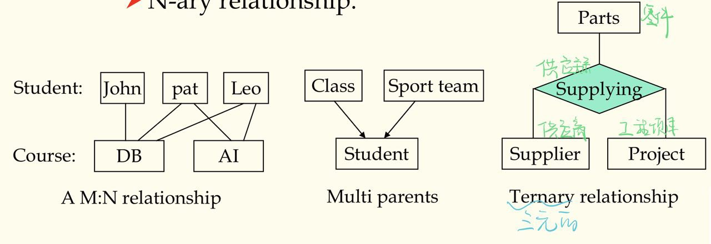
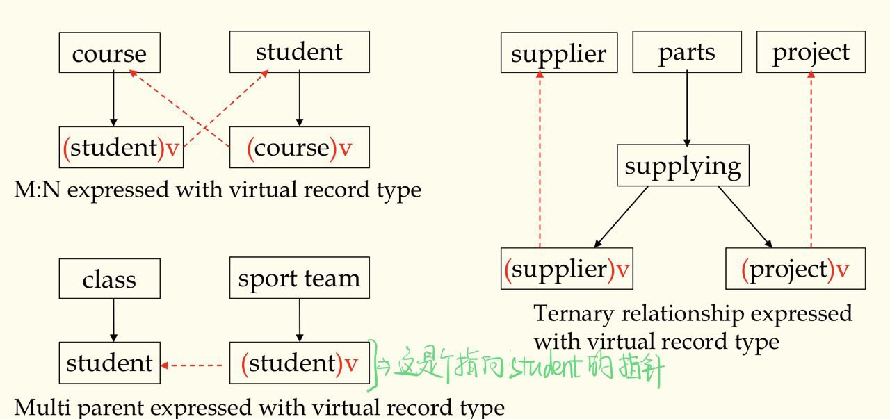
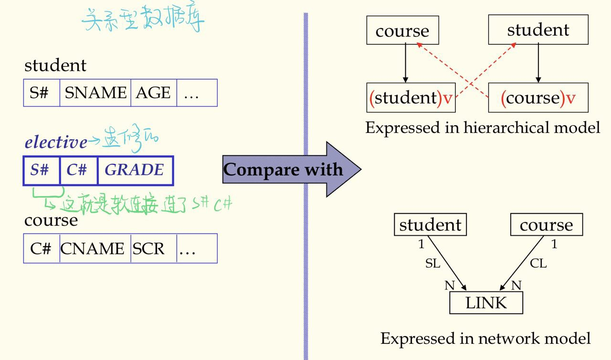
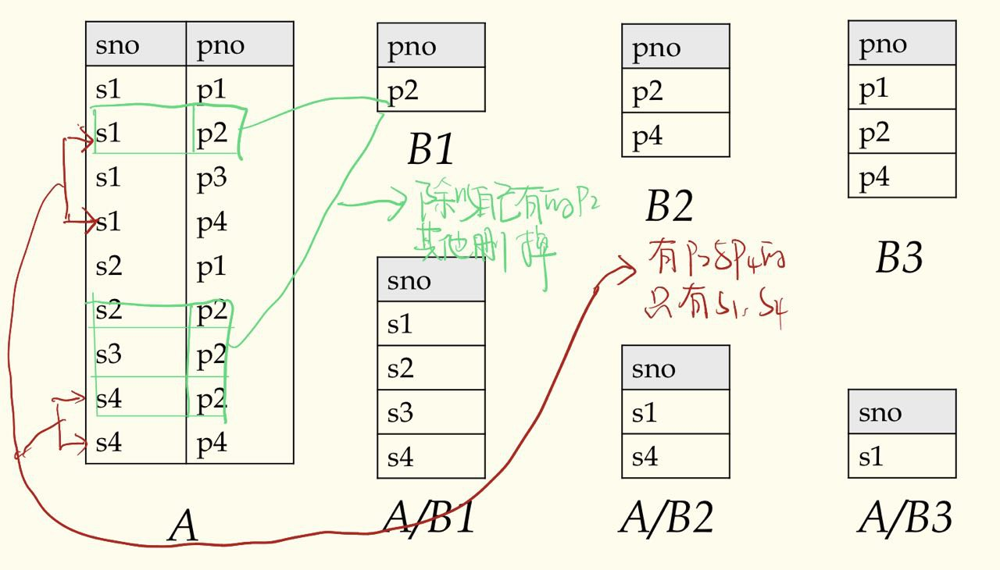
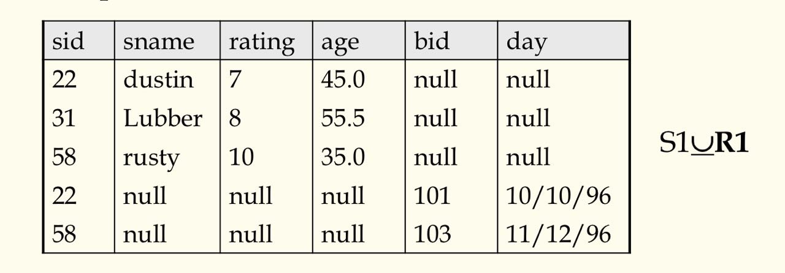
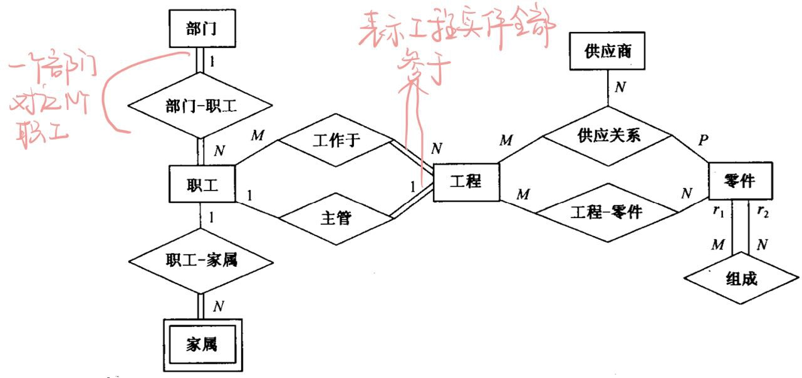

> 数据库管理系统第一，二，三章笔记

:car:

<!--more-->

# 第一章 介绍
---

## 1.1 介绍

### Database&DBMS

- 数据库：A very large, integrated collection of data
- 数据库系统： 一个设计来储存和管理数据库的软件包
- 文件与数据库的区别
  1. 数据量大
  2. 不同查询不同的代码
  3. 必须保持数据不变由于多位并发用户
  4. 奔溃能恢复
  5. 安全与访问控制
- 为啥用数据库系统
  1. 数据独立性与高效访问
  2. 减少应用开发时间
  3. 数据集成性与安全性
  4. 统一的数据管理员
  5. 并发访问，奔溃恢复

### Data, Data Model and Data Schema

- 数据：描述现实世界的符号
- **数据模型**：描述数据的一组概念和定义
- **数据模式**：对给定的数据模型的具体描述，数据模型的实例化


**高频考点**：

- **Data model**: a collection of concepts and definitions for describing data.
- **Data schema**: a description of a particular collection of data, using a given data model.


### 三层抽象架构(ansi-sparc architecture)及其对数据独立性的支持

> Schemas are defined using DDL

> Data is modified/queried using DML

- views:描述用户所看见的数据
- conceptual(logical) schema:定义数据的逻辑结构
- physical schema:描述文件与索引怎么用的

  

* 数据的独立性:

  - Applications insulated(绝缘的) from how data is structured and stored
  - Logical data independence: Protection from changes in logical structure of data
  - Physical data independence: Protection from changs in physical structure of data

### 数据库系统

- 数据库系统组成
  

  - 组成：应用，DBMS,数据库，DBA
  - DBMS 是数据库系统的核心
    - 高级的用户接口
    - 查询过程与优化
    - 目录管理
    - 并发控制与恢复
    - 完整性约束检查
    - 访问控制

- 数据库系统的生命周期
  - 数据库系统规划
  - 数据库设计
  - 数据库的创建
  - 数据库运行，管理与维护
  - 数据库的扩充与重构


# 第二章 数据模型
---
## 2.1 层次数据模型

### 基本概念

- 记录：描述事物与他们之间关系的数据单位，存储的数据单位,由多个字段构成
- 字段：简单的数据类型
- PCR(双亲子女关系，1:N 的关系)
- 分层模式：包含多对 PCRs，树状结构

### 拓展

- 虚拟记录：将层次数据模型推广到非层次型的数据（存在数据冗余）
  - 多对多的关系(M:N)
  - 一个记录型是两个以上的 PCR 的子女
  - 多元关系
    
  - 避免数据冗馀：只存一份记录，其他引用地方用指针代替。用指针代替的记录叫**虚拟记录**
    
  - 大量指针增加数据库开销，数据模式也不够直观清晰


## 2.2 网状数据结构：不做要求


## 2.3 关系数据模型

### 关系型数据库的特点

- Based on set theory, high abstract level
- Shield all lower details, simple and clear, easy to understand
- Can establish new algebra system -- relational algebra
- Non procedure query language -- SQL
- **Soft link** -- the essential difference with former data models
  

### 简单的概念们

#### 属性和域

- 每个属性对应的值的集合是为取值的范围即为域

#### 关系和元组

- 关系：就是表,属性是列，元组是行
- 关系的模式或型(schema)
  - $R = (A_1, A_2...A_n)$称为关系 R 的 schema
  - $A_i$是属性名
  - n 称为关系的目
- 元组
  - $r(R) = \{ t_1, t_2, ...t_m\}$,关系 R 表示为 r,为 n 目元组的集合
  - $t = <v_1, v_2, ..., v_n> v_i \in D_i$ 每个元组表示为 t，D 是域

#### 键：

- 超键：在关系中能唯一标识元组的属性集(**其子集也可以标识**),候选键的爸爸
- 候选键： 某一属性或一组属性唯一的决定了一个元组,且**其任何真子集无此性质**（不含多余属性的超键）
- 主键：候选键中的一个
- 全键(all key):若主键由所有属性组成，则称为全键
- 候补键：候选键中除主键外的
- 主属性：包含在任何一个候选键的属性
- 非主属性：不包含在任何一个候选键的属性
- 外键：关系 R1 不是主键，关系 R2 是主键，则其为关系 R1 外键

#### 最基本的三个完整性约束：

- 域完整性约束：属性值得在域中
- 实体完整性约束：一个关系内的约束，每个关系都要有一个主键，每个元组（实体）的主键值应唯一且不为 NULL
- 引用完整型约束：外键要么空缺，要么引用实际存在的主键值

### 关系代数

#### 基础操作：(完整的操作集合)

- 选择($\sigma$) : 选择几行，后面是布尔表达式
- 投影($\pi$) : 选择几列，后面也是布尔表达式
- 笛卡尔积($\times$): 连接两张表
- 集合差(-): 就是集合的差，韦恩图都懂的
- 并($\cup$) : 集合的并嘛

#### 额外操作：

- 连接($\Join$) : $R \Join_C S = (R\times S)$; C 是连接条件
- 除($\div$) : 除以自己有的，没的直接删
  
- 外连接:
  - 左外连接($* \Join$) :连接结果只保留左关系的所有元组
  - 右外连接($\Join*$) :连接结果只保留右关系的所有元组
  - 全外连接($* \Join *$) : 保留左右两关系的所有元组
    
- 外并($\underline{\cup}$): 对非兼容的两个关系也可以并，那些元组中没有的属性就填 NULL
  


这里的关系演算有时公式会很长，一定要有大局观，看好筛选条件，连接条件再去做可以省下九成的运算量


### 关系演算

> 关系代数表示关系操作，须标明关系操作的次序，注重过程,因而以关系代数为基础的数据库语言是过程语言

> 关系演算只要说明所要得到的结果，不必标明操作过程，注重结果,以关系演算为基础的数据库语言是非过程语言

> 共同点:They are equivalent in terms of expression. SQL language can express any query that is expressible in relational algebra/caculus.

#### 元组关系演算(TRC)

> 一般形式：$\\{ t[<属性表>] | P(t)\\}$

关系模式：R(ABC), r 为 R 的一个值

- 投影:$\Pi_{AB}(r) = \\{ t[AB] | t\in r \\}$
- 选择:$\sigma_{F}(R) = \\{t | t \in r \ AND\  F \\}$
- 并:$r \cup s= \\{t | t \in r  \ OR\ t \in s\\}$
- 差:$r - s = \\{t | t \in r \ AND\ \urcorner(t\in s)\\}$

设$R(ABC)$和$S(CDE)$,r,s 分别为其值

- 连接:$t \Join s = \\{t[ABCDE]|t[ABC] \in r \ AND\ t[CDE]\in s\\}$



- Why$\urcorner(t\in s)$ NOT $t\notin s$
- 好像是因为关系演算中没有$\notin$运算符


#### 域关系演算(DRC)

> 一般形式: $\\{ <x_1, x_2, ...,x_n> | P(x_1, x_2, ....x_n, x_n+1, ...x_n+m) \\}$

- 前面部分为结果中出现的域
- 后面部分为结果中满足每条记录满足的条件


$$\pi_{sid, sname, age}(\sigma_{age>35}(S_1)$$

- TRC:
$$\\{t[sid,sname,age]|t\in S_1 \wedge t.age > 35\\}$$
- DRC:
$$\\{<sid,sname,age>|<sid,sname,age>\in S_1 \wedge age > 35\\}$$
- TRC 中用的 t.age 而不是 t[age]；DRC 则直接用域名来做运算；另外别忘了加限制集，不然查询结果无穷大



## 2.4 ER 数据模型(实体联系数据模型)

> 是上面三种传统数据模型互相转换的中间模型

### ER 图

- 矩形：实体；双线矩形表示弱实体
- 菱形：关系
- 椭圆： 属性
- 弧上的数字表示联系的基数比；双线弧表示该实体全参与,单线表示部分参与
  

### 扩充 E-R 数据模型（我赌不考）

- 特殊化和普遍化：就是实体之间的继承,在弧上加$\cup$来表示
- 聚集：把参与联系的实体组合形成新的实体
- 范畴：超实体集并的子集

## 2.5 面向对象数据模型（没细讲）


## 其他数据模型

- 基于逻辑的数据模型
- 时态数据模型
- 空间数据模型
- XML 数据模型


# 第三章 用户接口和SQL语言
---
## 3.1 用户接口与 SQL 语言

- 关系代数是一种过程语言，以此设计的数据库语言，用户不仅要说明需要什么数据，还要说明获得这些数据的过程。
- 对用户来说，最好只说明需要什么数据，而如何获得这些数据则不必用户说明，而由系统来实现。即非过程语言。
- 非过程关系数据库语言里最成功的应用最广的:SQL 语言


## 3.2 SQL 语言概述

- SQL 指什么
  - IBM:Structured Query Language
  - ANSI(美国国家标准协会):Standard Query Language
  - wiki 百科，以及大部分资料都解释为第一种
- SQL 按功能分为四大部分
  - 数据定义语言(Data Definition Language):用于定义，撤销和修改数据模式
  - 查询语言(Query Language)：用于查询数据
  - 数据操纵语言(Data Manipulation Language)：用于增删改数据
  - 数据控制语言(Data Control Language)：用于数据访问控制


## 3.3 SQL 数据定义语言(DDL)[上课没提]

- 关系又称表，关系数据库的基本组成单位。
- 表分为两类
  - 基表：数据显式存在数据库中
  - 虚表（试图 view）：仅有逻辑定义，可根据其他基表或视图导出，不显式存在数据库中
- 对基表的操作
  - 增加列
  - 删除基表
  - 补充定义主键
  - 撤销主键定义
  - 补充定义外键
  - 撤销外键定义
  - 定义和撤销别名
  - 索引的建立和撤销


## 3.4 SQL 查询语言(QL)

### 基本的 SQL 查询语句

#### 基本格式

> 只有 SELECT 和 FROM 是必须的，别的子句可选

- SELECT 字句： 后接需要查询的项目
- FROM 子句： 指定了选择的数据表。FROM 子句也可以包含 JOIN 二层子句来为数据表的连接设置规则。
- WHERE 子句： 后接一个比较谓词以限制返回的行。WHERE 子句仅保留返回结果里使得比较谓词的值为 True 的行。
- GROUP BY 子句： 用于将若干含有相同值的行合并。 GROUP BY 通常与 SQL 聚合函数连用，或者用于清除数据重复的行。GROUP BY 子句要用在 WHERE 子句之后。
- HAVING 子句： 后接一个谓词来过滤从 GROUP BY 子句中获得的结果，由于其作用于 GROUP BY 子句之上，所以聚合函数也可以放到其谓词中。
- ORDER BY： 子句指明将哪个字段用作排序关键字，以及排序顺序(升序/降序)，如果无此子句，那么返回结果的顺序不能保证有序

#### 执行顺序

|   子句   | 顺序 |
| :------: | ---- |
|  SELECT  | 5    |
|   FROM   | 1    |
|  WHERE   | 2    |
| GROUP BY | 3    |
|  HAVING  | 4    |
| ORDER BY | 6    |

### SQL 的高端操作

- SELECT 后别名：可以用 `=`或`AS`
```sql
SELECT S.age, age1=S.age-5, 2*S.age AS age2
FROM Sailors S
WHERE S.sname LIKE 'B_%B'
```
- `LIKE`:用来模糊匹配字符串；`_`表示任一一个字符；`%`表示任意多个字符（包括 0 个）；上述表达为 B 开头与结尾长度至少为 3 的字符串
- `UNION`:对来能够给目相同的查询结果进行并操作，一般在 WHERE 子句中用`OR`代替


* `UNION`操作必须去重，如果允许，在其后加`ALL`则不消除结果中的重复项
* 多元`UNION`操作需要利用圆括号多次使用二元`UNION`来实现


- `INTERSECT`:对来能够给目相同的查询结果进行取交集操作，一般在 WHERE 子句中用`AND`代替
- 嵌套查询(Nested Queries):在 FROM,WHERE,HAVING 子句中可以包含 SQL 查询
  - \( NOT \) IN：前面有个主语,下例寻找定了 103 号船的水手姓名
```sql
SELECT S.sname
FROM Sailors S
WHERE S.sid IN (
  SELECT R.sid
  FROM Reserves R
  WHERE R.bid=103
)
```
  - `(NOT) EXISTS`:相关子查询，`EXISTS`后面不为空则
```sql
SELECT S.sname
FROM Sailors S
WHERE EXISTS (
  SELECT *
  FROM Reserves R
  WHERE R.bid=103 AND S.sid = R.sid
)
```
  - `ANY`和`ALL`:
    - `ALL`满足范围中所有的则返回 true
    - `ANY`满足范围中任意一个则返回 true,下例寻找得分高于任何一个名叫 Horatio 的水手
```sql
SELECT *
FROM Sailors S
WHERE S.rating > ANY (
  SELECT S2.rating
  FROM Sailors S2
  WHERE S2.sname = 'Horatio'
)
```

好像还有个 EVERY,只遇到一次，或许会做补充

  - `EXECPT`:除操作好像
- Aggregate Operators(聚集函数)

  - `COUNT(*)`: 返回表的总条目数
  - `COUNT([DISTINCT] A`):返回[不重复的]A 条目的总数
  - `SUM([DISTINCT] A)`:返回[不重复的]各个 A 属性的和
  - `AVG([DISTINCT] A)`:返回[不重复的]各个 A 属性的平均值
  - `MAX(A)`:A 属性的最大值
  - `MIN(A)`:A 属性的最小值

```sql
--得分为10的水手的平均
SELECT AVG(S.age)
FROM Sailors S
WHERE S.rating=10

--找得分最高的水手名字
SELECT S.sname
FROM Sailors S
WHERE S.rating=(
  SELECT MAX(S2.rating)
  FROM Sailors S2
)
```

### `GROUP BY` 和 `ORDER BY` 子句应用

#### `GROUP BY`

> `GROUP BY` 目的是让聚集函数作用于特定目标而非整个表

- `GROUP BY`子句将表按列的值分组，列值相同的一组，若有多个列，则先按第一列分组，再按第二列分组
- `HAVING`后为选择基本组的条件

#### `ORDER BY`

- 对子句中指定的列进行排序，默认升序，`ASC`表示升序, `DESC`表示降序
- 下例举出计算机系所开课程(成绩完整的 GRADE isn't NULL)的最高最低和平均成绩

```sql
SELECT SNO, MAX(GRADE), MIN(GRADE), AVG(GRADE)
FROM SC
WHERE CNO LIKE 'CS%'
GROUP BY CNO
HAVING CNO NOT IN (
  SELECT CNO
  FROM SC
  WHERE GRADE IS NULL
)
ORDER BY CNO
```

#### CAST expression

> 就是一些强制类型转换，`CAST (NULL AS Varchar(20))`把 NULL 转字符串

#### CASE expression

> PPT 上例子都是放在`SELECT`子句后，作用就和一般的`CASE`语句差不多，不考吧

### 子查询

本节例题所用数据模型

- `dept(deptno, deptname, location)`
- `emp(deptno, salary, bonus)`

#### 标量子查询(Scalar sub-query)

> 返回值只有一个单值，不是元组；can be used in the place where a value can occur

寻找平均奖金高于平均薪水的部门的名字

```sql
SELECT d.deptname
FROM dept AS d
WHERE (
  SELECT avg(bonus)--这里返回的是个单值
  FROM emp
  WHERE deptno = d.deptno)
    > (
  SELECT avg(salary)
  FROM emp
  WHERE deptno = d.deptno
  )
```

#### 表表达式(Table expression)

> 返回的是一个临时表(视图);can be used in the place where a table can occur

寻找总收入过两万的部门

```sql
SELECT  deptno, totalpay
FROM (
  SELECT deptno, SUM(salay) + SUM(bonus) AS totalpay
  FROM emp
  GROUP BY deptno) AS payrool
WHERE totalpay > 20000
```

#### 公用表表达式(Common table expression)

> 有一个表被用了很多次，则可使用`WITH`子句来定义它，是个临时的视图

寻找有最高收入的部门

```sql
WITH payroll(deptno, totalpay) AS (
  SELECT deptno, SUM(salary) + SUM(bonus)
  FROM emp
  GROUP BY deptno
)
SELECT deptno
FROM payroll--这里使用一次
WHERE totalpay = (
  SELECT max(totalpay)
  FROM payroll--这里又使用一次
)

```

#### 递归查询

> 如果一个临时表在其定义中引用了自己，则发生递归;分为三步，初始查询，递归查询，终止查询

寻找所有在 Hoover 管理下的薪水超过 100000 的员工

```sql
WITH agents(name, salary) AS
--Inital query
((SELECT name, salary
FROM FedEmp
WHERE manager='Hoover')
UNION ALL
--Recursive query
(SELECT f.name, f.salary
FROM agents AS a, FedEmp AS f
WHERE f.manager = a.name))
--Final query
SELECT name
FROM agents
WHERE salary>100000
```


这里应该还有外连接的 SQL 操作已经递归查询，但他妈的太复杂了,有心情写

- 递归查询好像挺重要，稍后攻克



## 3.5 数据操纵语言(Data Manipulation Language)

- Insert a tuple into a table
```sql
INSERT INTO EMPLOYEES VALUES ('Smith', 'John', '1980-06-10', 'Los Angles', 16, 45000)
```
- Delete tuples fulfill qualifications
```sql
DELETE
FROM Person
WHERE LastName = 'Rasmussen'
```
- Update the attributes' value of tuples fulfill qualifications

```sql
UPDATE Person
SET Address = 'Zhongshan23', City = 'Nanjing'
WHERE LastName = 'Wilson
```


## 3.6 嵌入式 SQL(in C)
> 由于ISQL功能受限于数据库操作,缺少数据处理能力。这种能力宿主语言有呀，所以就把SQL嵌入到宿主语言中去。


#### 嵌入式SQL的要解决的四个问题：
* 宿主语言编译器无法识别和接受SQL语言
  * 用`EXEC SQL...;`来标识
* 宿主语言程序和DBMS之间信息数据传输
  * 宿主变量，在SQL中加`:`标识
* 查询结果为元组集合，须逐个赋值给宿主语言中的变量
  * 游标方案
* 两者数据类型不完全对应，须解决数据类型转换问题
  * 就解决呗

 
### 嵌入式SQL的说明部分
* SQL语句以`EXEC SQL`开头，`;`结尾。
* 数据的传送通过宿主变量
* 宿主变量申明
  * 系统定义者:`SQLCA`(SQL Communication Area);其有个分量`SQLCODE`,它是一个整数，DBMS向应用程序报告SQL语句执行结果。

  |               <0               |     =0     |              >0              |                    100                     |
  | :----------------------------: | :--------: | :--------------------------: | :----------------------------------------: |
  | 错误未执行，负数值表示错误类型 | 无异常执行 | 执行但有异常，值表示异常类型 | 无值可取，可能没有符合条件的值也可能取完了 |

  使用时直接包含即可`EXEC SQL INCLUDE SQLCA`

  * 一般的宿主变量声明,开头`EXEC SQL BEGIN DECLARE SECTION`, 结尾`EXEC SQL END DECLARE SECTION`;宿主变量可以与表的列名同名，SQL语句中使用宿主变量时前面要加`:` 
```sql
EXEC SQL BEGIN DECLARE SECTION
  char SNO[7];
  char CNO[6];
  float GRADE;
  short GRADEI;
EXEC SQL END DECLARE SECTION
```

* 指示变量:indicator,也是宿主变量
* 宿主变量不能接受空缺符`NULL`,此时在其后跟一个指示变量，其值为负则前面的宿主变量为`NULL`,否则不为`NULL`
* 上例中`GRADEI`指示`GRADE`


### 嵌入式SQL的可执行语句
> 包括
> * 进入数据库系统的`CONNECT`语句
> * 嵌入的DDL,QL,DML,DCL
> * 控制事务结束的语句

#### `CONNECT` 语句
```sql
EXEC SQL CONNECT :uid IDENTIFIED BY :pwd
```
uid与pwd为两宿主变量

#### 嵌入的SQL
* DDL和DML：除了前面加`EXEC SQL`外与ISQL没有区别,如
```sql
EXEC SQL INSERT INTO SC(SNO, CNO, GRADE)
  VALUES(:SNO, :CNO, :GRADE)
```
* QL
  * 查询结果为一个数组，直接将查询结果用`INTO`子句对宿主变量进行赋值即可
```sql
EXEC SQL SELECT GRADE
  INTO :GRADE, :GRADEI --由于查询结果只可能有一个直接赋值即可
  FROM SC
  WHERE SNO = :GIVENSNO AND CNP = :GIVENCNO --{SNO, CNO}为主键
```
  * 查询结果为超过一个数组新开辟一个区域，存放查询结果的区域及其相应的数据结果称为游标,使用分四步

  * 说明游标语句

```sql
EXEC SQL DECLARE <cursor name> CURSOR FOR
  SELECT ...
  FROM ...
```

  * 打开游标语句
```sql
EXEC SQL OPEN <cursor name>;
```
  打开游标时，执行与之相关的QL,其结果存于游标中,一经打开即使查询语句中宿主变量值改变，游标值也不会变，除非关闭后重新打开

  * 取数语句
```sql
EXEC SQL FETCH <cursor name> 
  INTO :hostvar1, :hostvar2, ...;
```
  当游标中数取完，`SQLCODE`将返回100
  * 关闭游标语句
```sql
EXEC SQL CLOSE <cursor name>;
```
* 一个完整的例子,宿主语言是c语言,为了打印一张gpa3.5以上同学的名单。
```sql
EXEC SQL BEGIN DECLARE SECTION;
char sname[20];
EXEC SQL END DECLARE SECTION;

EXEC SQL DECLARE student-cursor CURSOR FOR --Step1：声明游标
  SELECT S.sname
  FROM student S
  WHERE S.gpa>3.5
EXEC SQL OPEN student-cursor;              --Step2：打开游标
while(TRUE)
{
  EXEC SQL FETCH student-cursor INTO :sname;

  if(SQLCA.SQLCODE==100) --读完了
    break;
  if(SQLCA.SQLCODE<0)    --出错了
    break;
  /*
  ...处理游标中所取的数据
  */
  printf("%s\n", sname);
};
EXEC SQL CLOSE C1;             --Step4：关闭游标

```