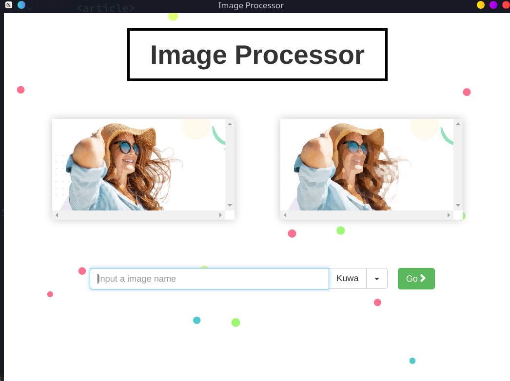
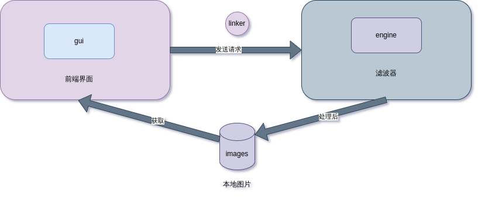
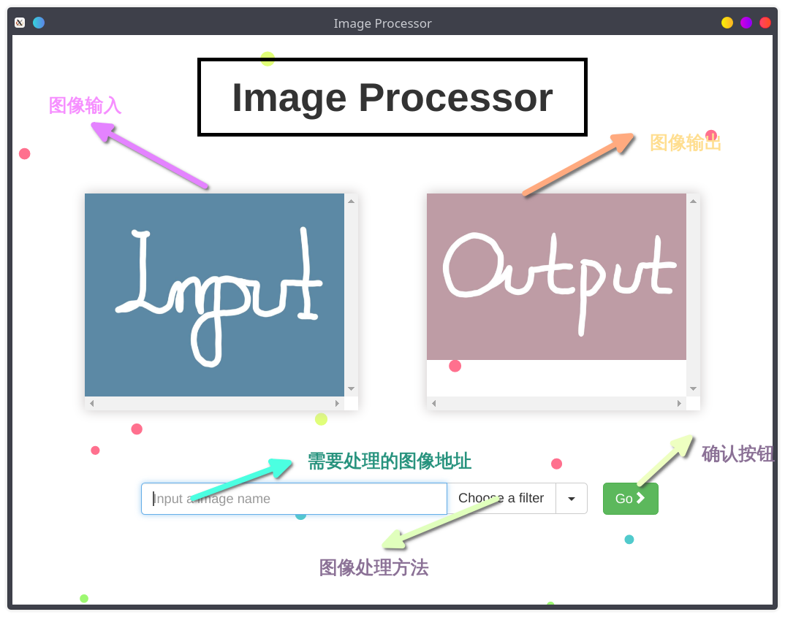
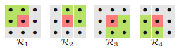
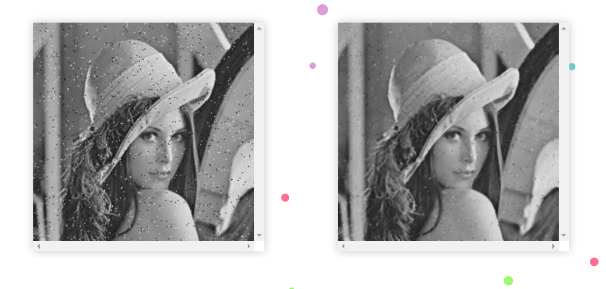

> 数字图像处理的大作业，使用 electron 作为前端框架，后端使用 python 来实现中值滤波， Kuwahara 滤波器(桑原滤波器)，灰度梯度分组技术。

<!--more-->



# 数字图像处理大作业：基于 electron 框架的多滤波器实现
> [项目地址](https://github.com/ACupofAir/filter-app.git)

## 设计背景

在经过一学期的数字图像处理课程后，我对数字图像处理的一些方法有所了解，在几次研讨中，我接触到了一些有趣的图像处理手段：

- 在第一次研讨中，我们对 glg(gray-level-grouping)算法进行了研讨，这是一种精妙的对比度增强算法，可以解决传统的对比度增强算法的众多痛点，如参数的调整，方式的选择；而且 fglg 具有极快的速度，非常适合生活中对于夜景图片的快速处理
- 最令我印象深刻的便是 Kuwahara 滤波器，它是在第二次研讨中讲解一般的图像平滑化方法时介绍的，经过它滤波后的图片有一种油画的风格，十分美观，这种滤波在我看来可以广泛应用于用户对于 p 图的需求

正是这些滤波的应用场景广泛，而一般的用户是不会使用 matlab 或者 python 去专门做这样的图像处理，一方面这需要一定的编程基础以及数字图像处理技术；另一方面这样的操作是繁琐的。是想没有人愿意为了简单的让图像的对比度增加而打开庞大的 matlab 套件，写上上百行代码。所以在这样的背景下，我设计了这个简单的数字图像处理程序。它将我们课中的研讨内容应用于实际，简化图像对比度增强，图像平滑处理的过程

## 设计思路

### 设计目标

- 易用性原则：有友好的用户界面，所见即所得，操作直观
- 可拓展性: 由于目前所学的图像处理技术有限，这样简单的功能是不足以作为一个完整的 app 的，我希望在未来可以拓展这个应用的功能

### 最终设计

- 语言的选择<br>

  在我们的课程中，我们大多采用 matlab 来实现图像处理，而在实际开发中，matlab 能发挥的空间有限。在之前的一次项目中，我尝试用 matlab 做 gui 开发，整个过程是轻松的，但最后导出时，它提供软件包的方式是直接将 matlab 中所使用的库完整的塞如软件包中，这就导致如果你的程序只是简单的 helloworld,它导出的包也有足足 1GB 大小，所以用 matlab 来做软件开发不是一个智慧的选择。

  对于后端来说，除 matlab 外，最适合做图像处理的想必就是 python 了，python 强大的开源社区提供了众多图像处理的包，同时，python 可以利用 pyqt 做桌面端的开发，再各个方面都是很优秀的。有了 python 的加持，在后续将其与人工智能的相关应用起来也会比较方便，具有良好的可拓展性。

  而前端方面，采用了 electron 框架，electron 在近几年大方异彩，诸如 vscode，facebook message,就是基于 electron 开发的。它具有极好的移植性，可以一套代码实现浏览器，windows,macos,linux,android 的全平台开发。所以前端代码我将使用 html, css, javascript 来实现。

- 前后端分离设计<br>

  为了应用良好的拓展性，我采用了前后端分离的架构。前端与后端完全独立，通过连接件来实现前端对后端的调用。

  完整的业务流程如下：

  1. 前端接受用户对于图片处理的请求，从本地图片库中读取图片。将用户对图片处理的要求以及图片传给后端
  2. 后端按要求处理图片后，将图片转存到本地，并提示前端已经完成操作
  3. 前端在得知已经完成图像处理后，按后端提供的地址去本地找到处理好的图片并显示

  

## 前端实现

由于本软件较为简单，所以直接采取单页面结构即可满足需求。

### 快速搭建

首先，我们利用 electron 官方给的脚手架程序进行快速搭建

```shell
# Clone this repository
git clone https://github.com/electron/electron-quick-start
# Go into the repository
cd electron-quick-start
# Install dependencies
npm install
# Run the app
npm start
```

这样我们便有了一个简单的 helloworld 程序。

### 目录重组

对于一个 electron 应用来说，它的程序入口为`main.js`，在这个文件中，它会初始化一个窗口，并加载一个 html 文件(所以说 electron 本质就是个浏览器),为了实现我们的前后端分离，我们将所有的界面文件放到 gui 这个文件夹，在 gui 这个文件夹下新建 index.html 用来做我们的单页面。同时在 gui 目录下新建 linkers 目录，用来存放连接件，新建 images 目录存放要处理的图片以及处理后的图片。然后修改`main.js`中加载的 html 文件路径为我们 gui 目录下的 html

```javascript
//main.js
mainWindow.loadURL(
  url.format({
    pathname: path.join(__dirname, "/gui/index.html"),
    protocol: "file:",
    slashes: true,
  })
);
```

然后我们创建 engine 目录用来存放后端的函数。最终我们项目的目录树如下：

```shell
├── engine
│   ├── FGLG.py
│   ├── kuw_filter.py
│   ├── mean_filter.py
│   └── __pycache__
├── filter.ico
├── gui
│   ├── background.svg
│   ├── images
│   ├── index.html
│   ├── linkers
│   └── styles.css
├── LICENSE.md
├── main.js
```

### 布局设计

- 顶部为软件的名称\*
- 中间主题部分为两个图像处理框，采用`overflow: scroll;`属性，来实现无损预览，当图片大于预览窗口，可以通过滚动滑轮在预览框内移动图片的位置来查看不同部分。
- 底部为一个输入框，用户需输入需要处理的图片的名称即可
- 输入框右边为一个复选框，用户可以选择不同的滤波器来对图像进行不同的处理:
  - Kuwa:桑原滤波器，将图片平滑化处理，类似于油画效果
  - glg:灰度梯度分组，提高图片的对比度
  - mean:中值滤波，对图片进行降噪处理
- 输入框右边是确认按钮，点击后将向后端发送处理图像请求
  

- 整体布局采用响应式布局，利用 twitter 开源的 bootstrap 框架，让界面可以弹性缩放。

## 后端实现

### Kuwahara 滤波器实现

#### 基本原理

计算图像模板中邻域内的均值和方差，选择图像灰度值较为均匀的区域的均值替代模板中心像素灰度值。总的来说模板半径越小，平滑化的效果越好，但相应的复杂度也越高


#### 核心代码

为了较快的给出结果，我将模板半径固定为 5,这样处理出的图像不至于模糊，同时速度也较快。

```python
def kuwahara(pic, r=5, resize=False, rate=0.5):
    h, w, _ = pic.shape
    if resize:
        pic = cv2.resize(pic, (int(w*rate), int(h*rate)))
        h, w, _ = pic.shape
    pic = np.pad(pic, ((r, r), (r, r), (0, 0)), "edge")
    ave, var = cv2.integral2(pic)
    ave = ((ave[:-r-1, :-r-1]+ave[r+1:, r+1:] -
           ave[r+1:, :-r-1]-ave[:-r-1, r+1:])/(r+1)**2)
    var = ((var[:-r-1, :-r-1]+var[r+1:, r+1:]-var[r+1:, :-r-1] -
           var[:-r-1, r+1:])/(r+1)**2-ave**2).sum(axis=2)

    def filt(i, j):
        return np.array([ave[i, j], ave[i+r, j], ave[i, j+r], ave[i+r, j+r]])[(np.array([var[i, j], var[i+r, j], var[i, j+r], var[i+r, j+r]]).argmin(axis=0).flatten(), j.flatten(), i.flatten())].reshape(w, h, _).transpose(1, 0, 2)
    filtered_pic = filt(
        *np.meshgrid(np.arange(h), np.arange(w))).astype(pic.dtype)
    return filtered_pic
```

### fglg 实现

#### 基本原理

灰度分组（GLG）基本步骤是先将低对比度图像的直方图分量按照选定的准则分组为适当数量的 bins，然后将这些 bins 均匀地分布在灰度上，最后将之前分组的灰度级解分组。其基本步骤如下：

1. 对强度非零组进行分组
2. 确定每组的左边界与右边界
3. 寻找最小组进行合并
4. 计算组间间距
5. 通过间距乘以组号来定位每组位置
   由于 glg 分组的组数是遍历所有可能，而合并又需遍历，所以复杂度为 $\mathcal{O}(n^2)$ ,而实际上经过大量实验发现在分组数过高时对图像对比度的增强已经没有太大帮助，实际上只需将分组固定为自己 20 组左右，就可以取得很好的效果，所以在固定分组数后复杂度为$\mathcal{O}(n)$,这就是 fglg 算法

#### 核心代码

代码过长，感兴趣可以阅读源码，具体的讲解在第一次研讨中已经汇报过了，当时用的是 matlab 实现的，python 版本和它基本没有太大区别

```python
def fglg(img):

    height, width = img.shape
    Npix = height * width
    hist = cv2.calcHist([img], [0], None, [256], [0.0, 255.0])

    # show histogram of the original image
    #plt.hist(hist.flatten(), 256)
    # plt.show()
    temp = [0]
    temp_gray_level = np.zeros(M)
    cnt = 1
    for i in range(M):
        if hist[i] != 0:
            temp.append(hist[i])
            temp_gray_level[cnt] = i
            cnt = cnt + 1
    n = len(temp) - 1
    G = [[0] for i in range(n+2)]
    gray_level = [[0 for _ in range(n+1)] for __ in range(n+1)]
    G[n] = temp
    gray_level[n] = temp_gray_level
    L = [[0] for i in range(n+2)]
    R = [[0] for i in range(n+2)]
    for k in range(M):
        if hist[k] != 0:
            L[n].append(k)
            R[n].append(k)
    T = [0 for i in range(M+2)]

    while n - 1 >= GROUP:
        # compute Gn-1,Ln-1,Rn-1,i'
        a = min(G[n][1:n+1])
        ia = G[n].index(a)
        left = True
        if ia == 1:
            b = G[n][ia+1]
            left = False
        elif ia == n:
            b = G[n][ia-1]
        else:
            if G[n][ia-1] <= G[n][ia+1]:
                b = G[n][ia-1]
                left = True
            else:
                b = G[n][ia+1]
                left = False
        if left:
            ii = ia - 1
        else:
            ii = ia
        for i in range(1, ii):
            G[n-1].append(G[n][i])
            gray_level[n-1][i] = gray_level[n][i]
        G[n-1].append(a+b)
        gray_level[n-1][ii] = gray_level[n][ii]
        for i in range(ii+1, n):
            G[n-1].append(G[n][i+1])
            gray_level[n-1][i] = gray_level[n][i+1]

        for i in range(1, ii+1):
            L[n-1].append(L[n][i])
        for i in range(ii+1, n):
            L[n-1].append(L[n][i+1])

        for i in range(1, ii):
            R[n-1].append(R[n][i])
        for i in range(ii, n):
            R[n-1].append(R[n][i+1])
        n = n - 1

    n = n + 1
    if L[n-1][1] != R[n-1][1]:
        N = (M - 1)/float(n - 1)
    else:
        N = (M - 1)/float(n - 1 - ALPHA)
    for k in range(0, M):
        if k <= L[n-1][1]:
            T[k] = 0
            continue
        if k >= R[n-1][n-1]:
            T[k] = M - 1
            continue
        i = 0
        for x in range(1, n):
            if k >= L[n-1][x] and k < R[n-1][x]:
                i = x
                if i > 0 and L[n-1][i] != R[n-1][i]:
                    if L[n-1][1] == R[n-1][1]:
                        ans = int(
                            (i - ALPHA - (R[n - 1][i] - k) / float(R[n - 1][i] - L[n - 1][i])) * float(N) + 1 + 0.5)
                        T[k] = ans
                    else:
                        ans = int(
                            (i - (R[n - 1][i] - k) / float(R[n - 1][i] - L[n - 1][i])) * float(N) + 1 + 0.5)
                        T[k] = ans
                elif i > 0 and L[n-1][i] == R[n-1][i]:
                    if L[n-1][1] == R[n-1][1]:
                        T[k] = int(((i - ALPHA) * float(N)) + 0.5)
                    else:
                        T[k] = int((i * float(N)) + 0.5)
            elif k == R[n-1][x]:
                i = x
                if L[n-1][1] == R[n-1][1]:
                    T[k] = int(((float(i) - ALPHA) * float(N)) + 0.5)
                else:
                    T[k] = int((i * float(N)) + 0.5)
             # There can be delete
            # if i == 0:
             #   T[n-1][k] = T[n-1][k-1]
    D = Trans_and_CalcD(hist, T)

    return T, D/(float(Npix) * (Npix - 1))
```

### 中值滤波实现

#### 基本原理

> 采用观察窗中的中值作为输出

- 流程
  1. 采用个奇数个采样组成观察窗口
  2. 对窗口中值进行排序，并选取中值输出
  3. 丢弃最早的值，取得新的采样，然后重复 1,2
- 示例
  $$
  x = [2 80 6 3]\\\\
  y[1] = Median[2 2 80] = 2\\\\
  y[2] = Median[2 80 6] = Median[2 6 80] = 6\\\\
  y[3] = Median[80 6 3] = Median[3 6 80] = 6\\\\
  y[4] = Median[6 3 3] = Median[3 3 6] = 3\\\\
  $$

于是 y = [2 6 6 3], 其中 y 是 x 的中值滤波输出

## 连接件

在前后端实现后，整个项目最关键的点是如何将其打通,为解决这个问题，我参考了 youtube 上一篇教程[here](https://www.youtube.com/watch?v=627VBkAhKTc),答案是`python-shell`。借助 python-shell 库，我们可以实现在 javascript 里调用 python 函数，而 js 正是也自然而然承担其连接前后端的重用。

首先我们需要倒入`python-shell`库。在项目根目录的`preload.js`中引入该库。`preload.js`为 electron 默认的预加载文件，若没有直接创建即可。

```javascript
let { PythonShell } = require("python-shell");
```

下面的代码展示了如何使用 PythonShell。我们利用 PythonShell 来实例化一个对象`pyshell`,它传入了我们要调用的 python 函数文件名以及要处理的图片名,同时我们利用 javascript 中 on 事件来反馈函数执行的情况，它会将调用的 python 函数的 print 的内容以 alert 的方式提供给用户。swal 是一个 alert 的样式，在 index.html 中引入如下代码即可 

```html
<script src="https://unpkg.com/sweetalert/dist/sweetalert.min.js"></script>
```

```javascript
function filter() {
  var imgName = document.getElementById("imgname").value;
  // Show preview of origin img
  let img_url = path.join(__dirname, "images", imgName);
  document.getElementById("img-prev-div").setAttribute("src", img_url);
  // Call the func of kuw python script
  var options = {
    scriptPath: path.join(__dirname, "../engine/"),
    args: [imgName],
  };
  let pyshell = new PythonShell("kuw_filter.py", options);
  pyshell.on("message", function (message) {
    swal(message);
  });
}
```

之后我们需要在 python 文件中配置传入的文件名参数`imgname = sys.argv[1]`,一行代码就传入了文件名，经过转化后我们即可拿到图片

至此我们的前后端完全打通，程序也可以运行。

## 程序运行

### 编译这个项目

- 首先我使用的 node 版本和 npm 版本如下，如果不同可能会编译失败，建议使用 nvm 来控制一下 node 版本

  ```shell
  ❯ node --version
  v16.13.1

  ❯ npm --version
  8.1.2
  ```

- 在项目根目录下执行
  ```shell
  npm install
  npm start
  ```
- 关闭 devtool

  为了方便调试，我默认开启了 devtool，在`main.js`中注释掉这行即可,若要在运行时开启点击顶部菜单栏view->toggle devtool，默认快捷键为`Ctrl+Shift+i`

  ```javascript
  mainWindow.webContents.openDevTools();
  ```

### 程序运行结果
> * 由于设计原因，所以图片都存储于images这个文件夹，如果你要使用自定义的照片，请将它放入该文件夹后，在输入框中输入图片名（需要后缀），然后选择你想使用的滤波器，点击绿色Go按钮后即可。
> * 另外首次使用由于程序读取处理后的图片和处理图片的过程是并发的，而处理图片的速度慢于读取速度，故会发生图片加载不出来的问题，但只要有蓝色alert done提示,则说明图片已经处理好了，这时`ctrl+r`刷新页面重复一下操作图片即可正确显示
> * 中值滤波时间较长，点击后耐心等待大约十秒左右，在弹出蓝色Done窗口后再刷新。

- 桑原滤波

- 灰度分组

- 中值滤波


## 实验总结
* 本次实验融合我在数字图像课程中学到的知识，以及研讨的成果，来实现了这个简单的软件；让我看到了数字图像处理在现实生活中是如此有用。
* 不足之处：程序本身由于时间的紧迫还有很多不足与bug,这将是我未来具有空闲时间将要弥补的地方 
    * javascript异步加载图片导致显示不出的问题
    * 优化中值滤波，它的耗时过长
    * 图片的存储位置随机化，通过拖入窗口来直接获取图片的位置
    * 界面美化
    * 滤波器目前只有三个，过少，未来可以拓展
* 可圈可点
    * 拓展性良好，后端代码增加后，只需简单几句添加连接件就可以实现新的滤波算法